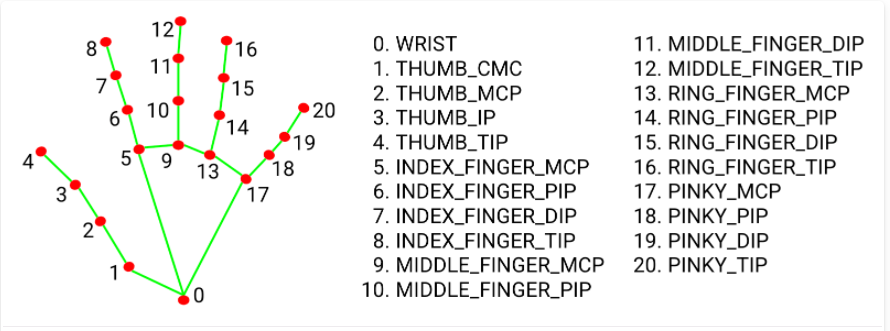
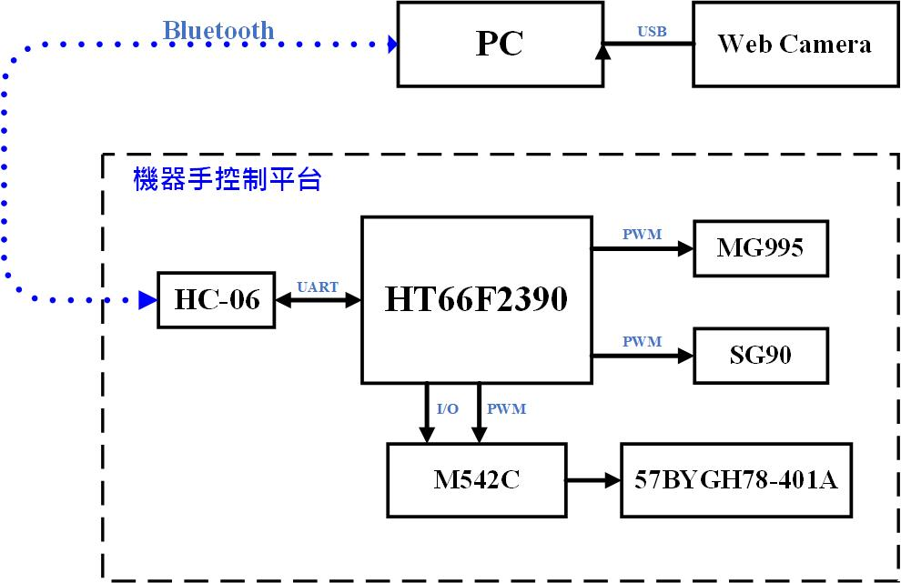
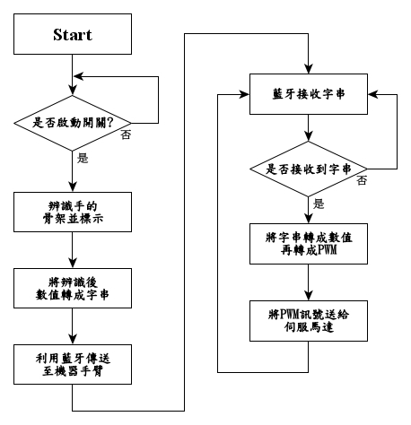

# Robot Arm Project
### 運用視覺AI之人機協作遙控系統

本作品是運用視覺 A I 技術來追蹤人的手勢，透過藍牙無線通訊模組 以遠端方
式操控機器手， 實現 人機協作。利用攝影機搭配 M ediaPipe 手勢追蹤技術， 辨識 操
作人員 手指彎曲變化的角度 ，再利用藍牙模組傳送角度至機器手 控制平台 控制各
個 伺服馬達 轉動角度，以模仿 手部動作 。

## Award

### 第16屆 盛群杯Holtek MCU創意大賽 C組8-Bit MCU應用 - 銀牌

## Schedule
| State   | Date     | Status Descriptions | Action items    |
|---------|----------|---------------------|-----------------|
| Monitor | 07/27/21 | 機械手掌3D圖形,已設計出雛形     | 用3D Printer列印手掌 |
| Open    | 07/25/21 |                     | 設計手掌3D圖形        |
| Close   | 07/28/21 |                     | Define Pin      |
| Open    | 08/27/21 | 增加GUI功能             |
| Monitor | 08/29/21 | 基本流程完成, 增加新功能       | 臉部辨識            |
| Monitor | 08/29/21 |                     | 增加登入資料功能        |

## Complete Item

| Date     | Descriptions                        |
|----------|-------------------------------------| 
| 06/~~/21 | 使用Google MediaPipe達到Hand Tracking功能 |
| 07/14/21 | 影像可以控制機器手掌之手指                    |
| 07/21/21 | 可控制步進馬達，帶動滑軌                        |
| 07/28/21 | 利用影像辨識手掌位置(左右)，即時控制滑軌轉動(左右)及速度調節    |
| 08/03/21 | 上傳勝群元件簽收單                           |
| 08/20/21 | Define PIN 完成                       |

## Hand Tracking 
Using Google MediaPipe Hand Tracking
### Hand Landmark Model

## Hardware Architectures

## Software Flowchart

## Pin Define

### Seven Segment

| Port G | Descriptions | Port F | Descriptions |
|:------:|:------------:|:------:|:------------:|
|  PG0   |    Seg a     |  PF0   |    COM 1     |
|  PG1   |    Seg b     |  PF1   |    COM 2     |
|  PG2   |    Seg c     |  PF2   |    COM 3     |
|  PG3   |    Seg d     |  PF3   |    COM 4     |
|  PG4   |    Seg e     |
|  PG5   |    Seg f     | 
|  PG6   |    Seg g     |

### Servo

| Port | Descriptions |  Servo  |
|:----:|:------------:|:-------:|
| PC6  |     STP0     | SG90 1  |
| PD0  |     STP1     | SG90 2  |
| PF7  |     STP2     | SG90 3  |
| PC2  |     PTP0     | SG90 4  | 
| PC4  |     PTP1     | SG90 5  |
| PD2  |     PTP2     | MG995 1 |
| 

### UART
#### Pin define
| Port | Descriptions | HC-06 |
|:----:|:------------:|:-----:|
| PA6  |      Rx      |  Tx   |
| PA7  |      Tx      |  Rx   |

#### Transport Protocol

| Sign | Action Descriptions    | Sign | Action Descriptions |
|:----:|:-----------------------|:----:|:--------------------|
| 'A'  | Servo 1: Thumb         | 'H'  | Motor Calbr         |
| 'B'  | Servo 2: Index_Finger  | 'S'  | Motor Stop          |
| 'C'  | Servo 3: Middle_Finger | 'R'  | Motor move right    |
| 'D'  | Servo 4: Ring_Finger   | 'L'  | Motor move left     |
| 'E'  | Servo 5: Pinky         | 'V'  | Motor Speed         |
| 'F'  | Servo 6: Arm           | 

### Step Motor and Sensor

| Port  | M542C | Sensor |
| :---: | :---: | :----: |
| PD3 | PUL |
| PD4 | DIR |
| PD5 | ENA |
| PD6 |     | SEN |